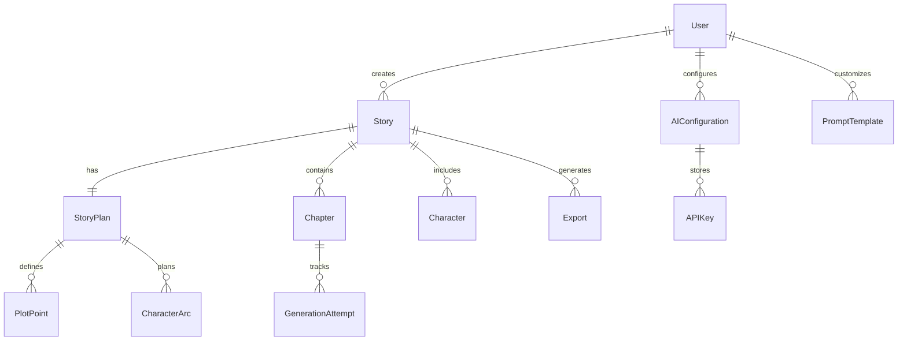

# Data Model: AI Story Generation App

**Date**: 2025-09-09  
**Feature**: AI Story Generation Platform  
**Branch**: `001-ai-story-generation`

## Entity Relationship Diagram



## Core Entities

### User
**Purpose**: Represents platform users with authentication and subscription management

| Field | Type | Constraints | Description |
|-------|------|------------|-------------|
| id | UUID | PK, NOT NULL | Unique user identifier |
| email | string(255) | UNIQUE, NOT NULL | User email for authentication |
| passwordHash | string(255) | NOT NULL | Bcrypt hashed password |
| subscriptionTier | enum | DEFAULT 'free' | free, pro, team, enterprise |
| storageQuota | integer | DEFAULT 10 | Max stories allowed |
| monthlyTokenUsage | integer | DEFAULT 0 | Current month token consumption |
| preferences | JSON | | UI preferences, default settings |
| createdAt | timestamp | NOT NULL | Account creation time |
| updatedAt | timestamp | NOT NULL | Last modification time |
| lastLoginAt | timestamp | | Last successful login |

**Validation Rules**:
- Email must be valid format
- Password minimum 8 characters with complexity requirements
- Subscription tier determines feature access

### Story
**Purpose**: Central entity representing a creative work with all metadata

| Field | Type | Constraints | Description |
|-------|------|------------|-------------|
| id | UUID | PK, NOT NULL | Unique story identifier |
| userId | UUID | FK → User.id | Story owner |
| title | string(500) | NOT NULL | Story title |
| premise | text | NOT NULL | Brief story description |
| genre | enum | NOT NULL | Romance, Thriller, Fantasy, etc. |
| subgenre | string(100) | | Specific subgenre |
| targetLength | integer | NOT NULL | Target word count |
| actualLength | integer | DEFAULT 0 | Current word count |
| targetAgeGroup | enum | | Children, YA, Adult |
| contentRating | enum | | G, PG, PG-13, R |
| readingLevel | enum | | Elementary to Advanced |
| themes | JSON[] | | Array of theme tags |
| tone | string(50) | | Overall narrative tone |
| writingStyle | string(100) | | Prose style preference |
| pov | enum | | First, Third Limited, Omniscient |
| tense | enum | | Past, Present |
| status | enum | DEFAULT 'draft' | draft, planning, generating, complete, archived |
| generationStartedAt | timestamp | | Generation start time |
| generationCompletedAt | timestamp | | Generation completion time |
| qualityScore | decimal(3,2) | | AI-calculated quality metric |
| createdAt | timestamp | NOT NULL | |
| updatedAt | timestamp | NOT NULL | |

**Validation Rules**:
- Target length must be between 100 and 500,000 words
- Genre must be from approved list
- Status transitions follow defined workflow

### StoryPlan
**Purpose**: Comprehensive outline generated before story creation

| Field | Type | Constraints | Description |
|-------|------|------------|-------------|
| id | UUID | PK, NOT NULL | |
| storyId | UUID | FK → Story.id, UNIQUE | One plan per story |
| totalChapters | integer | NOT NULL | Planned chapter count |
| actStructure | JSON | NOT NULL | Act breakdown with percentages |
| chapterSummaries | JSON[] | NOT NULL | Array of chapter outlines |
| storyArc | JSON | NOT NULL | Overall narrative progression |
| thematicProgression | JSON | | Theme development timeline |
| pacingMap | JSON | | Tension/pacing across chapters |
| estimatedGenerationTime | integer | | Minutes to generate |
| approved | boolean | DEFAULT false | User approval status |
| approvedAt | timestamp | | Approval timestamp |
| createdAt | timestamp | NOT NULL | |
| updatedAt | timestamp | NOT NULL | |

**Validation Rules**:
- Total chapters must match chapter summaries array length
- Act structure percentages must sum to 100
- Cannot generate without approval

### Chapter
**Purpose**: Individual story sections with content and metadata

| Field | Type | Constraints | Description |
|-------|------|------------|-------------|
| id | UUID | PK, NOT NULL | |
| storyId | UUID | FK → Story.id | Parent story |
| chapterNumber | integer | NOT NULL | Sequential order |
| title | string(500) | | Chapter title |
| plannedSummary | text | | From story plan |
| content | text | | Generated chapter text |
| wordCount | integer | DEFAULT 0 | Actual word count |
| targetWordCount | integer | | Expected word count |
| status | enum | DEFAULT 'planned' | planned, generating, generated, revised |
| generationAttempts | integer | DEFAULT 0 | Retry counter |
| lastGeneratedAt | timestamp | | Last generation time |
| qualityMetrics | JSON | | Consistency scores |
| createdAt | timestamp | NOT NULL | |
| updatedAt | timestamp | NOT NULL | |

**Validation Rules**:
- Chapter number must be unique per story
- Word count auto-calculated from content
- Status must follow generation workflow

### Character
**Purpose**: Story personas with development tracking

| Field | Type | Constraints | Description |
|-------|------|------------|-------------|
| id | UUID | PK, NOT NULL | |
| storyId | UUID | FK → Story.id | Parent story |
| name | string(255) | NOT NULL | Character name |
| role | enum | NOT NULL | protagonist, antagonist, supporting, minor |
| archetype | string(100) | | Hero, Mentor, Trickster, etc. |
| description | text | | Physical and personality traits |
| backstory | text | | Character history |
| goal | text | | Primary motivation |
| flaw | text | | Character weakness |
| arcType | enum | | flat, positive, negative, transformation |
| relationships | JSON | | Connections to other characters |
| firstAppearance | integer | | Chapter number |
| prominence | decimal(3,2) | | Story presence percentage |
| createdAt | timestamp | NOT NULL | |
| updatedAt | timestamp | NOT NULL | |

**Validation Rules**:
- Name must be unique within story
- At least one protagonist required
- Relationships reference valid character IDs

### AIConfiguration
**Purpose**: User-specific AI provider settings and preferences

| Field | Type | Constraints | Description |
|-------|------|------------|-------------|
| id | UUID | PK, NOT NULL | |
| userId | UUID | FK → User.id | Configuration owner |
| name | string(255) | NOT NULL | Configuration name |
| provider | enum | NOT NULL | openai, anthropic, google |
| model | string(100) | NOT NULL | Specific model version |
| temperature | decimal(2,1) | DEFAULT 0.7 | Creativity parameter |
| maxTokens | integer | DEFAULT 4000 | Max tokens per request |
| topP | decimal(2,1) | DEFAULT 1.0 | Nucleus sampling |
| frequencyPenalty | decimal(2,1) | DEFAULT 0 | Repetition penalty |
| presencePenalty | decimal(2,1) | DEFAULT 0 | Topic penalty |
| isDefault | boolean | DEFAULT false | Default for new stories |
| monthlyUsage | integer | DEFAULT 0 | Tokens used this month |
| isActive | boolean | DEFAULT true | Configuration status |
| createdAt | timestamp | NOT NULL | |
| updatedAt | timestamp | NOT NULL | |

**Validation Rules**:
- Temperature between 0 and 2
- Only one default per user
- Model must be valid for provider

### PromptTemplate
**Purpose**: Customizable generation prompts for different tasks

| Field | Type | Constraints | Description |
|-------|------|------------|-------------|
| id | UUID | PK, NOT NULL | |
| userId | UUID | FK → User.id | Template owner (null=system) |
| name | string(255) | NOT NULL | Template name |
| category | enum | NOT NULL | planning, chapter, character, revision |
| genre | string(100) | | Genre-specific template |
| taskType | string(100) | NOT NULL | Specific generation task |
| templateContent | text | NOT NULL | Prompt template with variables |
| variables | JSON[] | NOT NULL | Required variable definitions |
| exampleOutput | text | | Sample expected output |
| version | integer | DEFAULT 1 | Template version |
| isPublic | boolean | DEFAULT false | Available to all users |
| isDefault | boolean | DEFAULT false | Default for task type |
| usageCount | integer | DEFAULT 0 | Times used |
| averageRating | decimal(2,1) | | User ratings |
| createdAt | timestamp | NOT NULL | |
| updatedAt | timestamp | NOT NULL | |

**Validation Rules**:
- Template must include required variables
- Variables must use {{variable}} syntax
- Only one default per category/genre combination

### Export
**Purpose**: Generated story exports in various formats

| Field | Type | Constraints | Description |
|-------|------|------------|-------------|
| id | UUID | PK, NOT NULL | |
| storyId | UUID | FK → Story.id | Source story |
| userId | UUID | FK → User.id | Requesting user |
| format | enum | NOT NULL | pdf, epub, docx, markdown |
| fileName | string(500) | NOT NULL | Generated file name |
| fileSize | bigint | | File size in bytes |
| fileUrl | string(1000) | | Storage location |
| options | JSON | | Format-specific options |
| status | enum | DEFAULT 'pending' | pending, processing, complete, failed |
| processingTime | integer | | Generation time in seconds |
| downloadCount | integer | DEFAULT 0 | Number of downloads |
| expiresAt | timestamp | | URL expiration time |
| error | text | | Error message if failed |
| createdAt | timestamp | NOT NULL | |

**Validation Rules**:
- File URL expires after 7 days
- Format must be supported type
- Options validated per format

## Supporting Entities

### APIKey
**Purpose**: Encrypted storage of user API keys

| Field | Type | Constraints | Description |
|-------|------|------------|-------------|
| id | UUID | PK, NOT NULL | |
| userId | UUID | FK → User.id | Key owner |
| aiConfigId | UUID | FK → AIConfiguration.id | Associated config |
| provider | enum | NOT NULL | openai, anthropic, google |
| encryptedKey | text | NOT NULL | AES-256-GCM encrypted |
| keyHash | string(64) | UNIQUE | SHA-256 for duplicate detection |
| iv | string(32) | NOT NULL | Initialization vector |
| salt | string(64) | NOT NULL | Key derivation salt |
| authTag | string(32) | NOT NULL | Authentication tag |
| lastValidated | timestamp | | Last validation check |
| isValid | boolean | DEFAULT true | Current validity status |
| createdAt | timestamp | NOT NULL | |
| rotatedAt | timestamp | | Last rotation time |

### GenerationAttempt
**Purpose**: Track generation attempts for debugging and optimization

| Field | Type | Constraints | Description |
|-------|------|------------|-------------|
| id | UUID | PK, NOT NULL | |
| chapterId | UUID | FK → Chapter.id | Target chapter |
| attemptNumber | integer | NOT NULL | Sequential attempt |
| promptTokens | integer | | Input token count |
| completionTokens | integer | | Output token count |
| totalCost | decimal(10,4) | | Calculated cost in USD |
| provider | string(50) | | AI provider used |
| model | string(100) | | Model version |
| startedAt | timestamp | NOT NULL | |
| completedAt | timestamp | | |
| success | boolean | | Outcome |
| error | text | | Error details if failed |

### PlotPoint
**Purpose**: Key story events in the plan

| Field | Type | Constraints | Description |
|-------|------|------------|-------------|
| id | UUID | PK, NOT NULL | |
| storyPlanId | UUID | FK → StoryPlan.id | Parent plan |
| chapter | integer | NOT NULL | Chapter number |
| type | enum | NOT NULL | inciting, rising, climax, falling, resolution |
| description | text | NOT NULL | Event description |
| impact | enum | | minor, moderate, major |
| order | integer | NOT NULL | Sequence within chapter |

### CharacterArc
**Purpose**: Character development planning

| Field | Type | Constraints | Description |
|-------|------|------------|-------------|
| id | UUID | PK, NOT NULL | |
| storyPlanId | UUID | FK → StoryPlan.id | Parent plan |
| characterId | UUID | FK → Character.id | Character |
| startState | text | NOT NULL | Initial character state |
| endState | text | NOT NULL | Final character state |
| keyMoments | JSON[] | | Chapter-specific changes |
| arcType | enum | | Growth arc classification |

## State Transitions

### Story Status Flow
```
draft → planning → generating → complete
  ↓         ↓           ↓          ↓
archived  archived   archived   archived
```

### Chapter Status Flow
```
planned → generating → generated → revised
             ↓            ↓
          failed      regenerating
```

## Indexes

### Performance Indexes
- User.email (unique)
- Story.userId + Story.status (composite)
- Chapter.storyId + Chapter.chapterNumber (composite, unique)
- APIKey.keyHash (unique, for duplicate detection)
- Export.storyId + Export.createdAt (composite)

### Full-Text Search Indexes
- Story.title, Story.premise
- Chapter.content (for story search)
- Character.name, Character.description

## Data Retention Policies

- **Stories**: Retained indefinitely unless user deletes
- **Exports**: Files deleted after 30 days, records retained
- **Generation Attempts**: Pruned after 90 days
- **API Keys**: Deleted immediately upon user request
- **Audit Logs**: Retained for 1 year minimum